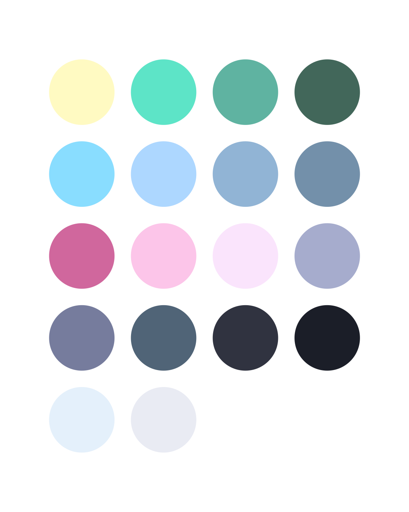

<p align="center">
  
  <h1 align="center">poimandres-warp 🎨</h1>
</p>

An unoffical [poimandres][poimandres] theme for the _(best)_ [warp][warp] terminal.

# Screenshots


## Installation and description

The available themes are normal and bright _(for obvious reasons there is no screenshot of the bright colors :smile:)_

### Installation

```
git clone https://github.com/neg4n/poimandres-warp && cd poimandres-warp && mv ./poimandres.yaml ~/.warp/themes/poimandres.yaml
```

## Related

- [poimandres][poimandres]: VSCode version
- [poimandres-iterm][poimandres-iterm]: iTerm version
- [poimandres-alacritty][poimandres-alacritty]: Alacritty version

Special thanks to the [original project][poimandres] and [drcmda](https://github.com/drcmda)
 for creating such a marvellous color scheme 

[poimandres]: https://github.com/drcmda/poimandres-theme
[poimandres-iterm]: https://github.com/alii/poimandres-iterm/
[poimandres-alacritty]: https://github.com/z0al/poimandres-alacritty
[warp]: https://www.warp.dev
